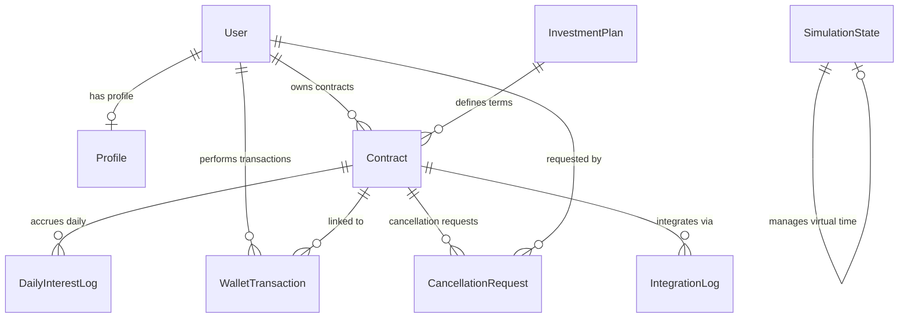

# 🏦 FaradBank Fixed-Yield Investment Engine (Backend)

Welcome to the backend architecture of the **FaradBank Fixed-Yield Investment Engine**. This system is built using **Python 3**, **Django**, and **Django REST Framework (DRF)**. It provides a secure, audit-ready, high-fidelity investment infrastructure equipped with a sub-contract structure, live CRM/MT5 system integration simulators, precise interest calculations, an early cancellation policy with penalties, and a complete time-travel simulation dashboard.

---

## 🌟 Core Business Rules & Financial Mechanics

The engine implements advanced banking ledger logic with several strict regulatory and financial requirements:

### 1. The Sub-Contract Structure
* **Liquidity Locking**: When an Investor creates a contract, the corresponding capital is debited from their CRM wallet (`WalletTransaction` record is created).
* **MT5 Read-Only Accounts**: An automatic MT5 API request is triggered to create a **Read-Only MT5 account** (`FaradBank_ReadOnly_[PLAN]`) specifically for this contract. The user receives login credentials for read-only tracking of live market activities.
* **Credit Block**: The contract principal is transferred to MT5 and locked using a credit block simulation. The principal cannot be traded or withdrawn early without approval.

### 2. Daily Accruals & Precision
* **Accrual formula**: Interest is accrued on a daily calendar basis:
  $$\text{Daily Interest} = \frac{\text{Principal} \times \left(\frac{\text{APY}}{100}\right)}{365}$$
* **Mathematical Precision**: Accrued interest is logged daily to `DailyInterestLog` with a precision of **6 decimal places** (`max_digits=15, decimal_places=6`) to avoid compounding rounding errors.
* **Maturity / Auto-Renewal**: On the exact maturity date, the system either:
  * Marks the contract as `MATURED`, releases the credit block from MT5, and credits the principal back to the investor's CRM wallet.
  * Auto-renews the contract for the same duration at the current APY, locking the principal again under a new contract.

### 3. Monthly Interest Settlement
* **Settlement Window**: Monthly interest payouts are settled between the **3rd and 5th of each calendar month** for the preceding month.
* **Aggregation & Rounding**: The system aggregates all unpaid `DailyInterestLog` records from the previous month, rounds the total sum to **2 decimal places** (standard wallet resolution), credits the investor's wallet as an `INTEREST_PAYOUT`, and marks the daily logs as `is_paid = True`.

### 4. Plan Upgrades
* **Permitted Upgrades**: Investors can upgrade their contracts only to **longer-term plans** (e.g., 3-Month to 6-Month).
* **Maturity Extension**: The contract maturity date is automatically extended to reflect the new duration.
* **Rate Lock Transition**: The current APY remains locked for the current calendar month. The upgraded APY is stored as a `pending_upgrade_apy` and is activated on the **1st of the next calendar month**.

### 5. Early Cancellation Policy
* **Plan Restrictiveness**: The **1-Month Liquidity Plan** is strictly **non-cancellable** (`is_cancellable = False`).
* **Penalty & Clawback**: For cancellable plans, early termination requires a **10% penalty on the principal** AND a **100% clawback of all interest paid so far** under the contract.
* **Approval & Settlement**: Early cancellation requires Manager approval. Once approved, the contract is put in `PENDING_CANCELLATION` status. The principal release and penalties are processed on the **3rd of the following calendar month** (during the standard monthly settlement cycle).

---

## 📊 Database Model Architecture (ERD)

The database schema is designed for strict financial audit trails.



### Model Definitions

| Model | Description | Crucial Fields |
| :--- | :--- | :--- |
| **`Profile`** | Extends the Django `User` model to store the role (`INVESTOR`, `MANAGER`) and current wallet balance (USDT). | `balance`, `role` |
| **`InvestmentPlan`** | The financial terms of the time deposits. | `id` (e.g., `1m`, `3m`), `duration_months`, `interest_rate_apy`, `is_cancellable`, `cancellation_penalty_pct` |
| **`Contract`** | A user's active investment under a plan. | `principal`, `interest_rate_apy`, `status` (`ACTIVE`, `PENDING_CANCELLATION`, `CANCELLED`, `MATURED`), `start_date`, `maturity_date`, `auto_renew`, `mt5_account_id`, `pending_upgrade_apy` |
| **`DailyInterestLog`** | High-precision record of interest earned per contract per day. | `date`, `amount` (6 decimals), `is_paid`, `paid_at` |
| **`WalletTransaction`** | The general ledger tracking all money movement. | `type` (`DEPOSIT`, `WITHDRAWAL`, `INVESTMENT`, `INTEREST_PAYOUT`, `REFUND`, `PENALTY`, `CLAWBACK`), `amount` |
| **`CancellationRequest`** | A request for early termination, detailing penalties and clawbacks. | `status` (`PENDING`, `APPROVED`, `REJECTED`), `penalty_amount`, `clawback_interest_amount`, `estimated_refund_amount`, `refund_date` |
| **`IntegrationLog`** | Real-time simulator tracking communication payloads sent to CRM and MT5 servers. | `action`, `request_payload`, `response_payload`, `status` (`SUCCESS`, `FAILED`) |
| **`SimulationState`** | Stores the system's global **Virtual Date** for time travel operations. | `virtual_date` |

---

## 🔌 REST API Endpoints Reference

All API routes are grouped under the `/api/` prefix.

### 🔑 Authentication & Wallet APIs

#### `POST /api/auth/login/`
Mock login endpoint that auto-creates users on demand for easy local testing.
* **Payload**:
  ```json
  {
    "username": "investor",
    "role": "INVESTOR"
  }
  ```
* **Response**: Returns a JWT token placeholder and user profile details. The user is pre-seeded with `5,000.00 USDT` for immediate testing.

#### `GET /api/wallet/`
* **Query Parameters**: `username` (string)
* **Response**: Returns the profile structure and wallet balance.

#### `POST /api/wallet/`
Simulates top-ups coming from an external CRM gateway.
* **Payload**:
  ```json
  {
    "username": "investor",
    "amount": "1500.00"
  }
  ```

#### `GET /api/wallet/transactions/`
Returns complete chronological transaction ledger audit history for a user.
* **Query Parameters**: `username` (string)

---

### 📈 Investment Plans & Contracts

#### `GET /api/plans/`
Lists all available time deposit investment options.

#### `POST /api/contracts/`
Submits a new principal investment contract. Debits wallet, creates MT5 sub-account, and blocks the principal balance in MT5.
* **Payload**:
  ```json
  {
    "username": "investor",
    "plan": "6m",
    "principal": "2000.00",
    "auto_renew": true
  }
  ```
* **Response**: Full contract metadata, start date, maturity date, and assigned MT5 sub-account login.

#### `POST /api/contracts/<id>/upgrade/`
Upgrades an active contract to a longer-term plan.
* **Payload**:
  ```json
  {
    "plan_id": "1y"
  }
  ```

#### `POST /api/contracts/<id>/toggle-renewal/`
Enables or disables auto-renewal upon maturity.

#### `GET /api/contracts/<id>/cancel/`
Generates a real-time **Cancellation Invoice Preview** showing calculation breakdown: principal, 10% penalty, clawback amount, and estimated net refund.

#### `POST /api/contracts/<id>/cancel/`
Submits early termination request. Moves contract status to `PENDING_CANCELLATION` awaiting manager approval.

---

### 🏢 Back Office Admin APIs (Manager Role)

#### `GET /api/admin/overview/`
Returns macro-financial parameters: Total Assets Under Management (AUM), Active User count, and AUM allocation metrics grouped by plan.

#### `GET /api/admin/cancellations/`
Lists all `PENDING` early cancellation approval requests.

#### `POST /api/admin/cancellations/`
Approve or reject a pending cancellation request.
* **Payload**:
  ```json
  {
    "request_id": 1,
    "action": "APPROVE"
  }
  ```
  *(Use `"action": "REJECT"` and optional `"rejection_reason": "..."` to reject and restore contract to `ACTIVE`)*.

#### `GET /api/admin/reporting/`
Returns financial forecasts: Payable interest from the previous month and lists of contracts maturing in the upcoming calendar month.

#### `GET /api/admin/user-audits/`
Returns detailed profiles of investors, audit summaries, open contracts, and historical plan upgrade transactions.

#### `GET /api/admin/integration-logs/`
Exposes the MT5 health checks and logs requests sent to MT5/CRM terminals.
* **Response**:
  ```json
  {
    "mt5_connection_status": {
      "connected": true,
      "latency_ms": 12.45,
      "broker": "MetaQuotes Software Corp.",
      "server": "FaradBank-Live",
      "active_sockets": 28
    },
    "logs": [...]
  }
  ```

---

### ⏱️ Time Travel & Simulation Controller

The system features an advanced, stateful **simulation engine** that allows developers to fast-forward time to test payouts, renewals, and cancellations across weeks or years.

#### `GET /api/simulation/state/`
Returns current **Virtual Date** of the engine.

#### `POST /api/simulation/time-travel/`
Fast-forwards the engine's internal calendar.
* **Payload**:
  ```json
  {
    "days": 45
  }
  ```
  *(Or use `"months": 2`)*.
* **Execution Logic**:
  The system loops day-by-day between the old and new dates:
  1. **1st of Month**: Evaluates pending upgrades and switches contract APYs to their upgraded values.
  2. **Every Day**: Accrues daily interest for active contracts and handles maturity release or renewal on the contract's maturity date.
  3. **3rd of Month**: Automatically executes the monthly payout cycles (`INTEREST_PAYOUT` transactions) and releases refunds for approved early-cancelled contracts.

---

## 🛠️ Installation & Local Setup

Get the backend running locally in less than 5 minutes:

### 1. Initialize Virtual Environment
```bash
# Navigate to backend directory
cd backend

# Create virtual environment
python -m venv venv

# Activate virtual environment
source venv/bin/activate
```

### 2. Install Dependencies
```bash
pip install django djangorestframework django-cors-headers
```

### 3. Run Migrations & Database Seeding
Execute database initialization and run the built-in custom seed script:
```bash
# Apply Django internal tables
python manage.py migrate

# Seed investment plans, simulation state, and mock accounts
python manage.py seed_data
```
The seed script configures:
* Plans: `1m` (10% APY), `3m` (12% APY), `6m` (14% APY), `1y` (16% APY), `2y` (18% APY), and `5y` (22% APY).
* **Virtual Date**: Initialized to `2026-05-19`.
* Accounts:
  * **Investor**: Username `investor`, password `password123` (Preloaded with `10,000.00 USDT`).
  * **Manager**: Username `manager`, password `password123`.

### 4. Fire up the Development Server
```bash
python manage.py runserver
```
The server will start listening at `http://127.0.0.1:8000/`. You can navigate to `http://127.0.0.1:8000/api/plans/` or access the Django admin suite at `http://127.0.0.1:8000/admin/`.
